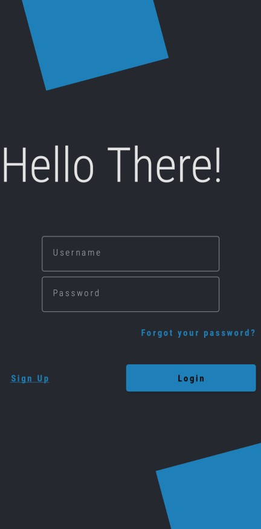
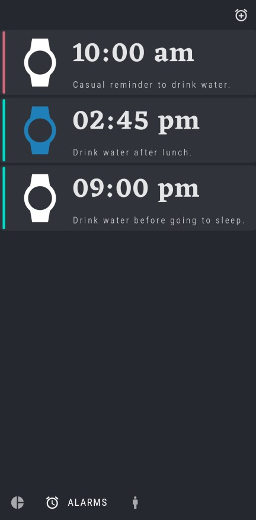
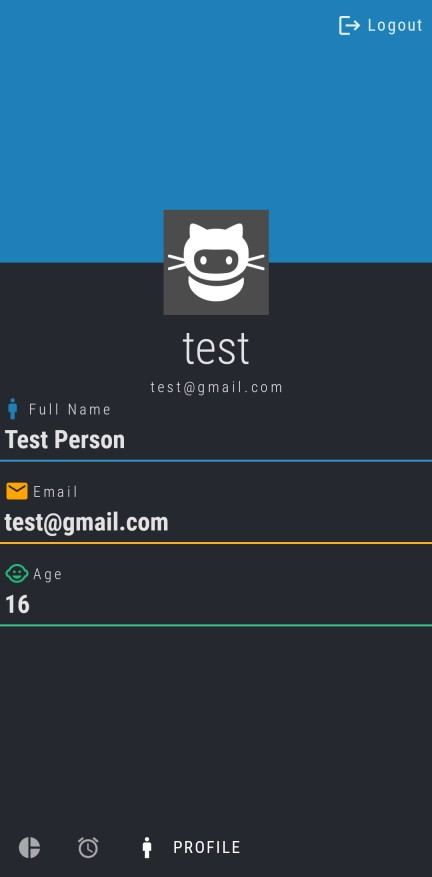
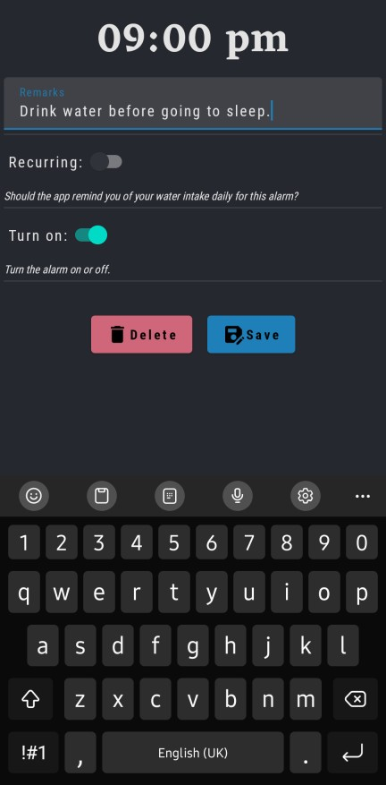
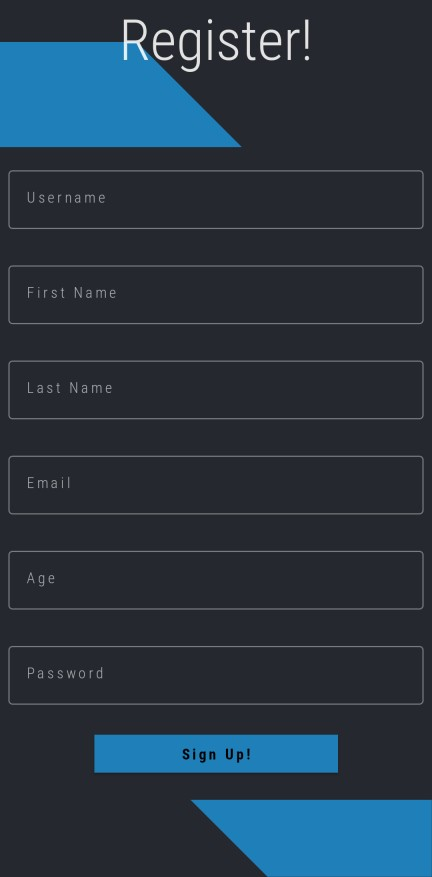

# Hydro Bro

Drinking water companion app for all the hydro bros out there!!

'Hydro Bro' is an application for android smartphones running android 10 and higher that will remind you to drink some water at set intervals. You may login and start using the app right away or, you can register to set up a profile in just a couple of seconds.

## Login

If you've got an account, you may login using your credentials at the login screen. This will allow you to access all the features provided by the application. 

> ❗Please note that logging in will require an active internet connection.

## Overview, Alarm and Profile

After you've successfully logged in, you may now explore the different screens on the app. Just click on the desired bottom bar icon and the app will navigate you to your desired screen!

|       |  ||
| ----------- | ----------- |-----------|
|       |        ||

## Add new alarm

What good would a scheduling application if you cannot add a new schedule!! To add a new alarm click on the top right alarm icon on the 'Alarms Screen' and you'll get a option to pick a desired time. After that, to enable the alarm you can click on the alarm you've just added and toggle the 'Turn on' switch. You can also toggle the 'Recurring' switch if you want the app to remind you about hydration on a daily basis.

## Sign-up

Don't have an account? No problem!! We've got you covered. You can register by clicking on the register button on the login screen and filling up the form. 

> ❗Please note that signing up will require an active internet connection.

## Using pre-seeded data

Don't want to register but still want to use the app? User the following credentials to login to see some pre-seeded alarms.

Username: test
Password: Mypassword1!
